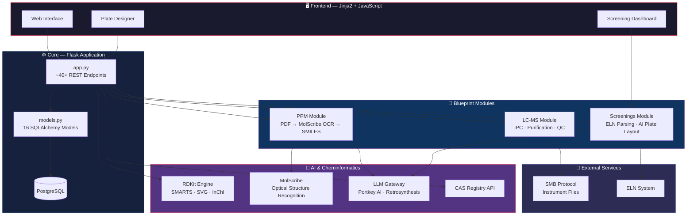

<div align="center">

# 🐬 Dolphin Platform V2

**AI-Augmented Chemical Research Management**

[](https://github.com/oriolvillalavela/dolphin-platform/actions)
[](https://www.python.org/downloads/)
[](LICENSE)
[](https://www.rdkit.org/)
[](https://github.com/astral-sh/ruff)

*A platform bridging cheminformatics, large language models, and laboratory automation for accelerated chemical discovery.*

</div>

---

## Summary

Modern pharmaceutical research demands tight integration between **chemical inventory management**, **high-throughput experimentation (HTE)**, and **analytical data pipelines**. Dolphin Platform V2 addresses this by providing a unified web-based system that combines:

1. **Structured chemical data management** — SMILES/InChI parsing, functional group detection, and CAS Registry lookups.
2. **LLM-augmented molecular intelligence** — Optical Chemical Structure Recognition (OCSR) via [MolScribe](https://github.com/thomas-young-2013/MolScribe), with AI fallback for SMILES extraction of external reports.
3. **Autonomous experiment design** — AI-driven plate layout generation for high-throughput screenings, integrating ELN parsing with intelligent reagent assignment.
4. **End-to-end LC-MS analytics** — Automated IPC measurements, purification tracking, and quality control pipelines with direct instrument file access via SMB protocol.

---

## Architecture



---

## Directory Structure

```
dolphin_platform/
├── app.py                          # Main Flask application (~40+ endpoints)
├── models.py                       # SQLAlchemy ORM (16 models)
├── database.py                     # PostgreSQL engine & session factory
├── Dockerfile                      # Multi-stage production build
├── pyproject.toml                  # PEP 621 project metadata
├── requirements.txt                # Pinned pip dependencies
├── environment.yml                 # Conda environment specification
│
├── blueprints/                     # Modular Flask blueprints
│   ├── lc_ms/                      #   LC-MS: IPC, purification, products
│   │   ├── api.py                  #     REST endpoints
│   │   ├── routes.py               #     Page rendering
│   │   └── utils.py                #     SMB file access, data parsing
│   ├── ppm/                        #   Project Process Management
│   │   ├── api.py                  #     REST endpoints
│   │   ├── extractor.py            #     PDF → region detection pipeline
│   │   ├── molscribe_runner.py     #     MolScribe OCSR integration
│   │   ├── ai_fallback.py          #     LLM-based SMILES prediction
│   │   └── normalization.py        #     Chemical name normalization
│   └── screenings/                 #   High-Throughput Screening
│       ├── api.py                  #     REST endpoints (plate CRUD, ELN)
│       ├── ai_layout.py            #     LLM-driven plate layout generation
│       └── lcms_backend.py         #     LC-MS integration for screenings
│
├── utils/                          # Shared cheminformatics utilities
│   ├── chem_utils.py               #   RDKit: SMARTS matching, SVG, PDF export
│   └── chem_converter/             #   CAS/IUPAC/SMILES/InChI converters
│
├── tests/                          # pytest test suite
│   ├── conftest.py                 #   Shared fixtures
│   └── test_chem_utils.py          #   Unit tests for chem_utils
│
├── notebooks/                      # Research demonstration notebooks
│   └── demo.ipynb                  #   Interactive capability showcase
│
├── templates/                      # Jinja2 HTML templates
├── static/                         # CSS, JavaScript, icons
├── data/                           # Sample datasets (CSV/XLSX)
├── LCMS_Analysis_Tool/             # Standalone Streamlit LCMS app
└── .github/workflows/ci.yml       # GitHub Actions CI pipeline
```

---

## Installation

### Option 1: pip (recommended for development)

```bash
# Clone the repository
git clone https://github.com/oriolvillalavela/dolphin-platform.git
cd dolphin-platform

# Create virtual environment
python -m venv .venv
source .venv/bin/activate    # Linux/macOS
.venv\Scripts\activate       # Windows

# Install with all extras
pip install -e ".[dev,test,notebook]"
```

### Option 2: Conda (recommended for RDKit)

```bash
conda env create -f environment.yml
conda activate dolphin
```

### Option 3: Docker (production)

```bash
docker build -t dolphin-platform .
docker run --rm -p 8000:8000 \
  -e DB_NAME=dolphin \
  -e DB_HOST=host.docker.internal \
  -e DB_PORT=5432 \
  -e DB_USER=postgres \
  -e DB_PASSWORD=changeme \
  dolphin-platform
```

### Environment Variables

Create a `.env` file in the project root:

```env
DB_NAME=dolphin
DB_HOST=localhost
DB_PORT=5432
DB_USER=postgres
DB_PASSWORD=your_password

# External services (optional)
CAS_API_KEY=your_cas_api_key
PORTKEY_API_KEY=your_portkey_key
```

---

## Quick Start

### 1. Chemical Structure Processing

```python
from utils.chem_utils import compute_functional_groups, generate_structure_svg

# Aspirin (acetylsalicylic acid)
smiles = "CC(=O)Oc1ccccc1C(=O)O"

# Detect functional groups via SMARTS substructure matching
groups = compute_functional_groups(smiles)
print(groups)
# ['aromatic_ring', 'carboxylic_acid', 'ester']

# Generate publication-quality SVG
svg = generate_structure_svg(smiles, width=400, height=400)
with open("aspirin.svg", "w") as f:
    f.write(svg)
```

### 2. RDKit Molecular Descriptors

```python
from rdkit import Chem
from rdkit.Chem import Descriptors

mol = Chem.MolFromSmiles("CC(=O)Oc1ccccc1C(=O)O")

print(f"Molecular Weight:  {Descriptors.MolWt(mol):.2f}")
print(f"LogP:              {Descriptors.MolLogP(mol):.2f}")
print(f"H-Bond Donors:     {Descriptors.NumHDonors(mol)}")
print(f"H-Bond Acceptors:  {Descriptors.NumHAcceptors(mol)}")
print(f"Rotatable Bonds:   {Descriptors.NumRotatableBonds(mol)}")
# Molecular Weight:  180.16
# LogP:              1.31
# H-Bond Donors:     1
# H-Bond Acceptors:  4
# Rotatable Bonds:   3
```


---

## Testing

```bash
# Run all tests
pytest

# With coverage report
pytest --cov=utils --cov-report=html

# Run only fast unit tests
pytest -m "not slow"
```

---

## Contributing

We welcome contributions. Please follow these guidelines:

1. **Fork** the repository and create a feature branch
2. **Install** dev dependencies: `pip install -e ".[dev,test]"`
3. **Lint** your code: `ruff check . --fix`
4. **Type-check**: `mypy utils/`
5. **Test**: `pytest`
6. **Submit** a pull request with a clear description

---

</div>
